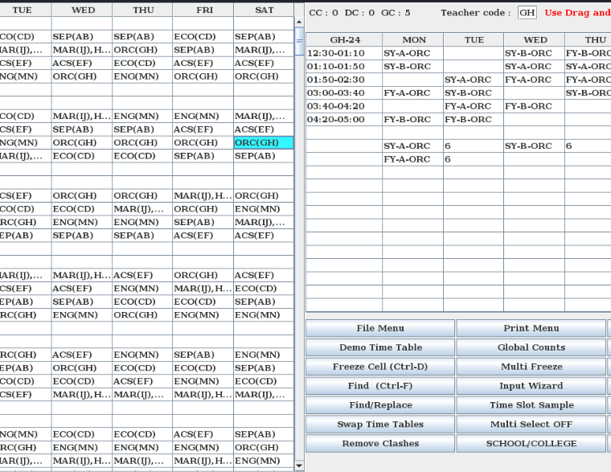

<!-- TTG -->

<p align="center">
  
</p>

<p align="center">
  
  
  
  
</p>

<p align="center">
  
  
  
  

</p>

<p align="center"><b>A User Friendly Time Table Generating Program Written In Java.</b></p>

##
<h3><p align="center">Disclaimer</p></h3>
<i>Any actions and or activities related to <b>TTG</b> is solely your responsibility.
<b>This Tool is made for institutional/organizational purposes only.

##

### Features

- Latest and updated logs with very simple interface.
- User friendly
- Multiple staffing options
  - Staff code
  - Demo module for understanding
  - Duplicate detection enabled
  - Simple and similar interface, similar to excel 
- Java also supports low end systems 
- User support provided by author hariJP for bug reports and doubts.

##
### Installation

- Just, Clone this repository -
  ```
  git clone https://github.com/hariJP/TTG
  ```

- Now go to cloned directory and run using 
  ```
  java
  ```
  

- On first launch, It'll seeks for updates. ***TGG*** is installed.

##

##

<details>
  <summary><h3>Dependencies</h3></summary>

<b>TTG</b> requires following programs to run properly - 
- `git`
- `java`
- `jar or jre`

> All the dependencies will be installed automatically when you run **TGG** for the first time.


</details>

<details>
  <summary><h3>Tested on</h3></summary>

- **Kali**
- **Ubuntu**
- **Debian**
- **Arch**
- **Manjaro**
- **Fedora**
- **Windows**
</details>


##

<h3 align="center"><i>Interface</i></h3>
<p align="center">

</p>

##
### Find Me on:
<p align="left">
  <a href="https://www.instagram.com/hari.jayram" target="_blank"></a>
  <a href="https://github.com/hariJP" target="_blank"></a>
</p>
